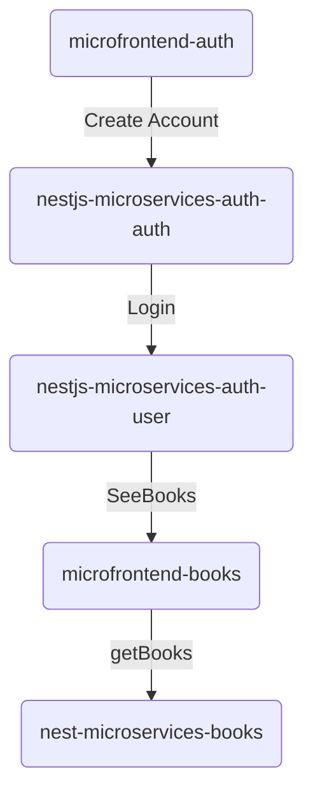

# Micro frontend and microservices with Docker

# Flow diagram

# Sequence diagram
```
sequenceDiagram
    frontend_auth->>+backend: /auth/login
    backend->>-frontend_auth: token(if success)
    frontend_auth-->>+frontend_books: /books 
    frontend_books-->>-backend_books: /searchBooks
    backend_books-->>+frontend_books: books(json format)            
```
# Microservices

### Microservices are written in typescript with NestJs as a Node.js framework

### For authorisation we used nestjs and check headers if tocken was set or not, also in order to communicate with an external service/emit or send messages we use ClientProxy.
```
const res = await this.client.send(
        { role: 'auth', cmd: 'check' },
        { jwt: req.headers['authorization']?.split(' ')[1]})
```

### There are 3 projects for backend side, 2 for auth part and one that handles the book library.

# Microfrontends

### For the microfrontends we have also 3 microfrontends, one that does the auth part (login, create account), second is resposible for books requests(getBook, seeBooks), and the third one is a container that links both the other ones and connect them.

### To expose important data, such as tocken for authorisation, we used localStorage:
```
  const [token, setToken] = useLocalStorage('token', null);
```

### We used Webpack Module Federation to have the option to execute runtime integration for our micro frontend applications.

## Docker
# After you cloned the app you should go out from the project folder and execute

```
    docker build microservices\ -t nestjs # this create nestjs image based on Dockerfile
```

# Libs
### As a third party app we integrate https://openlibrary.org/
